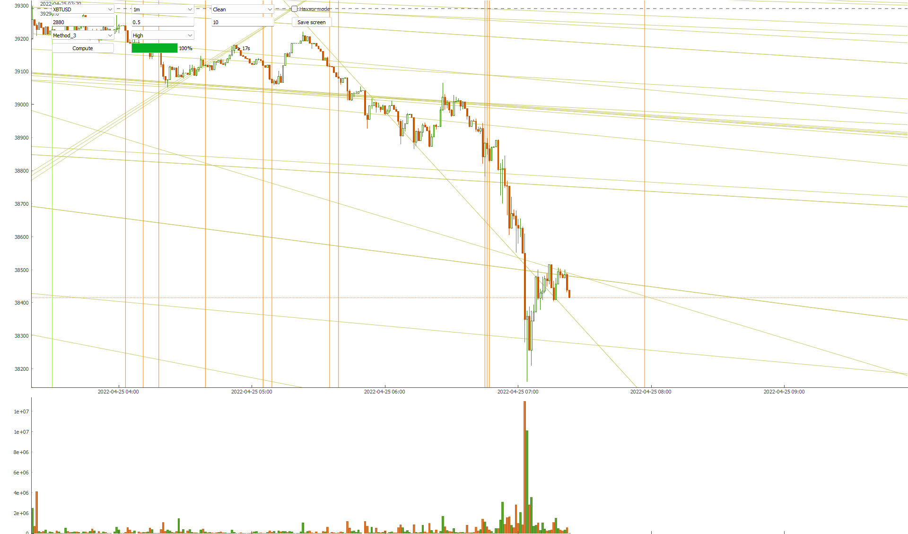

# GodRays
Full auto-analyzing script using GodRays' methodology to reveal key levels in crypto-markets

------------------------------------

Financial markets in general are far more organized than anyone suspects and this tool is here to show you what I mean by that... By using simple trendlines and by looking for their crossings, it can extract important information from price action as supports, resistances and precise temporal targets !

Here's a simple demo of the general concept : https://youtu.be/KQys_AF9JRM

------------------------------------

  

------------------------------------

Configuration

Install python 3.9 and run `pip install -r requirements.txt`

No API keys required !

------------------------------------

Execution

Run `python GR_Analyzer_v1.0.py` and a window will pop up, allowing you to set your own parameters. 

* History -> Number of periods to analyze
* Tolerance -> Tolerance in $ for the Triple Crosses Detection
* Tolerance 2 -> Tolerance for the Parallelism Detection
* Method_1 -> Simple scan of parallel forcelines
* Method_2 -> Simple scan of crossing points alignment
* Method_3 -> Adding Complex Multi-TimeFrames Analysis to method_2 (H1, M5 and M1)
* All -> Display all the Temporal Targets available
* Medium -> Display only the moderate and important Temporal Targets
* High -> Display only important Temporal Targets

Click on "Compute" when you are ready and let it crunch numbers.

------------------------------------

Donations to allow further developments

BTC: 3BMEXbS4Neu5KwsiATuZVowmwYD3UPMuxo

------------------------------------

## Disclaimer
The article and the relevant codes and content are purely informative and none of the information provided constitutes any recommendation regarding any security, transaction or investment strategy for any specific person. The implementation described in the article could be risky and the market condition could be volatile and differ from the period covered above. All trading strategies and tools are implemented at the users’ own risk.
